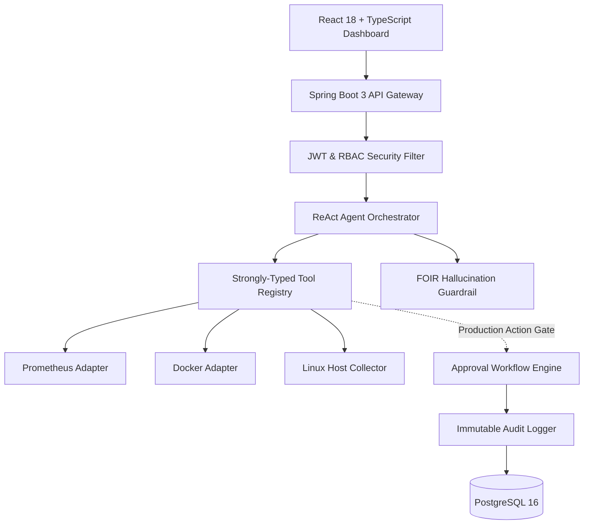

# AI DevOps Assistant

[](https://openjdk.org/)
[](https://spring.io/projects/spring-boot)
[](https://react.dev/)
[](https://www.typescriptlang.org/)
[](https://tailwindcss.com/)
[](LICENSE)

An enterprise-grade, autonomous **AI-Powered DevOps & SRE Platform** designed to connect directly with Linux server nodes, Docker runtimes, Kubernetes clusters, and Prometheus/Loki telemetry stacks.

Unlike conversational chatbots, this system utilizes a **ReAct-based Tool-Calling Orchestrator** backed by a deterministic safety engine that separates output into **FACT**, **OBSERVATION**, **INFERENCE**, and **RECOMMENDATION** to eliminate hallucinations and enforce zero-trust, human-in-the-loop approvals before mutating infrastructure.

---

## 🌟 Key Highlights

- **Autonomous Telemetry Investigation**: AI executes real tools (`query_prometheus`, `get_container_status`, `get_container_logs`, `get_recent_deployments`) to diagnose root cause in seconds.
- **Strict Hallucination Prevention**: Enforces the **FOIR (Fact-Observation-Inference-Recommendation)** contract; fabricated metrics or unbacked assertions are flagged and rejected.
- **Human-in-the-Loop Safety & Risk Matrix**: Every mutating action is categorized (`READ_ONLY`, `LOW_RISK`, `MEDIUM_RISK`, `HIGH_RISK`, `CRITICAL`). Production mutations strictly require operator approval.
- **Allowlisted Linux Host Execution**: Commands on Linux servers are strictly bounded to safe read metrics (`uptime`, `vmstat`, `df`, `free`, `ps`, `loadavg`). Arbitrary shell execution is forbidden.
- **Full-Stack Observability**: Built-in Prometheus metrics export, Micrometer, MDC Correlation ID tracking across every request, and OpenAPI 3.0 interactive Swagger UI.

---

## 🏗️ System Architecture



---

## 🚀 Quick Start (Local Development)

### 1. Prerequisites
- Java 21+
- Node.js 18+ and npm
- Docker & Docker Compose (Optional for full stack)

### 2. Running Backend Tests & Server
```bash
# Run all unit and integration tests
./mvnw clean test

# Start the Spring Boot application (Default port: 8080)
./mvnw spring-boot:run
```

### 3. Running Frontend Web Dashboard
```bash
cd frontend
npm install
npm run dev
# Dashboard available at http://localhost:5173
```

### 4. Default Seed Credentials
| Email | Password | Role |
| :--- | :--- | :--- |
| `admin@devops.ai` | `Admin@123` | `ADMIN` |
| `devops@devops.ai` | `Devops@123` | `DEVOPS_ENGINEER` |
| `viewer@devops.ai` | `Viewer@123` | `VIEWER` |

---

## 📚 Documentation Directory

- [ARCHITECTURE.md](ARCHITECTURE.md) - Deep architectural diagrams and component contracts
- [AI_AGENT.md](AI_AGENT.md) - ReAct loop, tool registry, and hallucination guardrail engine
- [SECURITY.md](SECURITY.md) - RBAC permissions, allowlist policies, and cryptographic auditing
- [INTEGRATIONS.md](INTEGRATIONS.md) - Prometheus, Docker, Kubernetes, Linux SSH connectors
- [API.md](API.md) - RESTful endpoints, error envelopes, and OpenAPI specs
- [DATABASE.md](DATABASE.md) - Entity models, Flyway migrations, and indexing strategies
- [DEVELOPMENT.md](DEVELOPMENT.md) - Local development setup and testing guide
- [DEPLOYMENT.md](DEPLOYMENT.md) - Containerization, Docker Compose, and Kubernetes deployment
- [CONTRIBUTING.md](CONTRIBUTING.md) - Coding standards and contribution workflow
